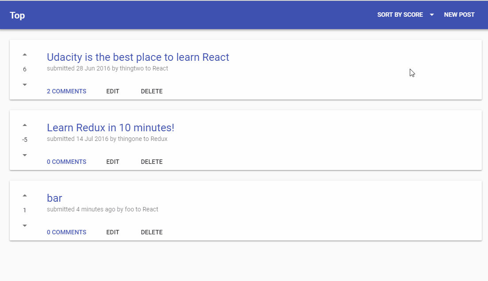
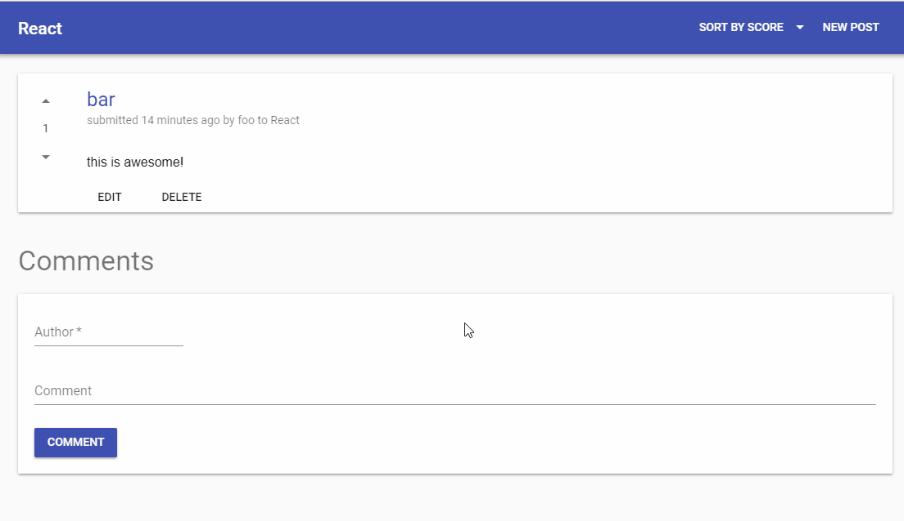
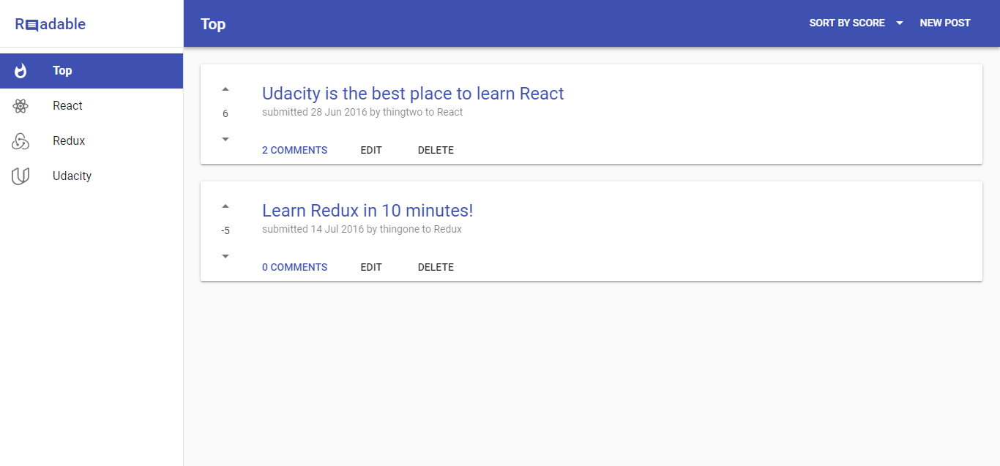
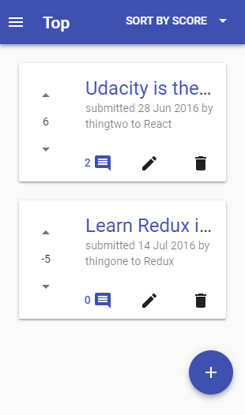

   
  
   
   

## Table of content
- [Introduction](#introduction)
- [Instalation](#installation)
- [Usage](#usage)
    - [Posting](#posting)
    - [Commenting](#commenting)
- [Responsive UI](#responsive-ui)        
- [Development](#development)

## Introduction

Readable is the second project of [Udacity's React Nanodegree](https://www.udacity.com/course/react-nanodegree--nd019) course which students were asked to build a content and comment web app.

In Readable, users are able to post content to predefined categories, comment on their posts and other users' posts, and vote on posts and comments. Furthermore, users are also able to edit and delete posts and comments.

This repository also includes the code for the backend API Server that was used to develop and interact with the front-end portion of the project.

## Installation

* Backend API server
    - `cd api-server`
    - `npm install`
    - `node server`

* Front-end UI
    - `cd frontend`
    - `npm install`
    - `npm start`

## Usage

Readable was developed to be a straightforward, easy and clean interface for the user.

### Posting

### Commenting

## Responsive UI

Following the [philosophy of responsiveness](https://material.io/guidelines/layout/responsive-ui.html) in Material Design, Readable interface is able to adapt its layout at various screen sizes for optimal user experience.

    
   
   
    

## Development

Readable made use of various awesome packages available in the web:

- [create-react-app](https://github.com/facebookincubator/create-react-app)
- [redux](https://github.com/reactjs/redux)
- [react-redux](https://github.com/reactjs/react-redux)
- [react-redux-router](https://github.com/reactjs/react-router-redux)
- [react-router](https://github.com/ReactTraining/react-router)
- [redux-thunk](https://github.com/gaearon/redux-thunk)
- [react-easy-validation](https://github.com/mattp94/react-easy-validation)
- [material-ui](https://github.com/callemall/material-ui)

